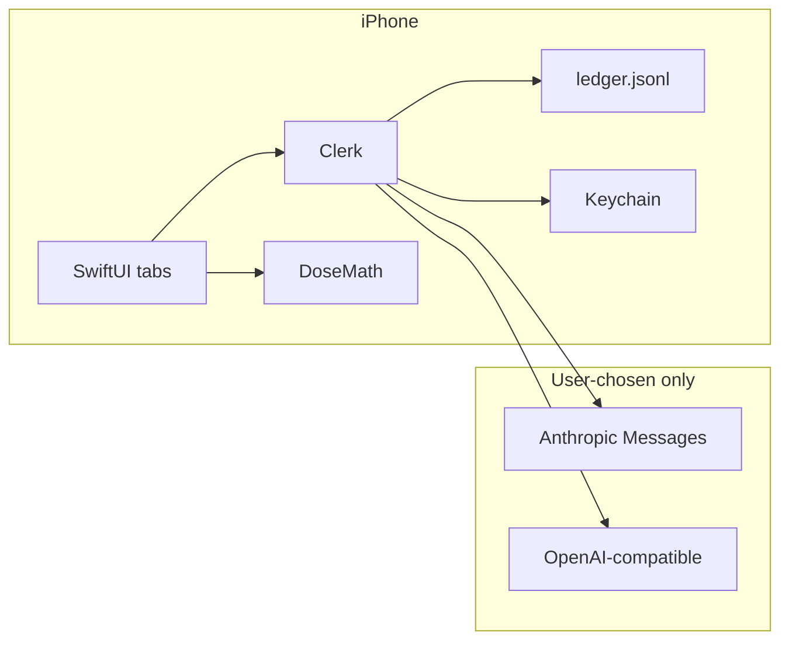

# Peptide Ledger

[](https://github.com/Mr-Neutr0n/peptide-ledger/actions/workflows/ci.yml)
[](LICENSE)

Working name. Native iOS ledger for people who inject from vials. You ramble
(voice or text) and drop a photo of a vial you already have. The app
proposes structured rows. You tap to confirm. It is a filing clerk, not a
coach.

Not a medical device. 17+.

[Intended use](docs/intended-use.md) · [Regulatory checklist](docs/regulatory-checklist.md) · [Security](SECURITY.md)

## Why

Shot loggers still open on a form. Vial users still lose reconstitution
numbers in Notes. Existing apps either assume a pen, hide history behind
a subscription, or let a model invent a protocol. This repo files what
you already did, on the phone, with a key you brought.

Design rules, enforced in code:

- **No dosing advice.** No recommended-dose library. Compound cards, if
  any, are user-supplied or cited; otherwise they stay empty.
- **Math never happens inside the model.** `DoseMath` owns reconstitution,
  concentration, draw volume, and sanity flags. IU is potency and will
  not convert to mass without a factor you typed.
- **Model proposes, user confirms.** Confirmed events are append-only.
  Corrections are new events that supersede. The ledger rebuilds from
  JSONL.
- **BYOK, no backend.** Key in Keychain. HTTPS only to the host you
  picked. No analytics SDK.

## What you can do in v0

- Unlock with Face ID or passcode.
- Accept the first-launch disclaimer, paste a provider key, pick
  Anthropic or an OpenAI-compatible base URL.
- Dictate or type a ramble, attach a vial photo (on-device OCR), review
  proposed rows and gaps, accept or reject each row.
- See the timeline and current vials (remaining volume when the numbers
  exist).
- Run the reconstitution tool: your mass, your diluent, your dose, the
  formula printed back.
- Export JSONL and CSV from the share sheet. Delete everything in
  Settings.

## Architecture



Libraries (testable on macOS): `DoseMath`, `LedgerCore`, `ModelClient`,
`LabelOCR`, `Clerk`. The iOS target is generated by XcodeGen from
`project.yml`.

## Install (development)

Xcode 26, iOS 18 deployment target, Swift 6.

```sh
brew install xcodegen
./verify
open PeptideLedger.xcodeproj
```

Select the `PeptideLedger` scheme and an iPhone destination. Paste a
model API key in onboarding. Do not commit keys.

Eval fixtures (no network): `swift test --filter EvalTests`. Live key
instructions are in `eval/README.md`.

## License

[Apache License 2.0](LICENSE). Attribution in [NOTICE](NOTICE).
