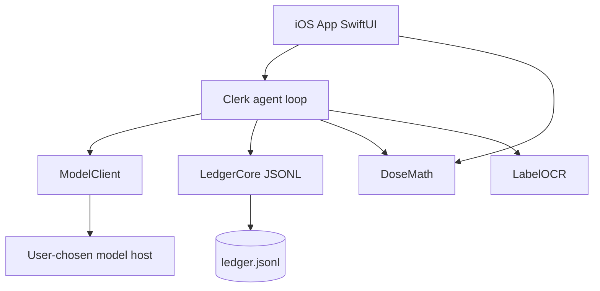

# iOS architecture notes (2026)

Research pass before the first commit. Links are the primary sources.
Choices that followed are in `docs/decisions.md`.

## SwiftUI structure and navigation

Apple's current container is `NavigationStack`, not `NavigationView`.
Typed `NavigationPath` is the documented way to push Codable routes.
https://developer.apple.com/documentation/swiftui/navigationstack

This app is five tabs (Capture, Ledger, Vials, Tools, More) plus a lock
overlay and a first-launch onboarding stack. Tabs are iOS 18 `Tab`
syntax. There is no deep hierarchical graph yet, so a path-based router
would be ceremony. Each tab owns a `NavigationStack` for Export and
Settings.

`@Observable` (Observation) is the state object model. `ObservableObject`
is legacy. App state lives in `AppState` at the environment.

## SwiftData

WWDC26 ("What's new in SwiftData") still tells you to use `@Query` inside
SwiftUI views. iOS 27 adds `ResultsObserver` and `HistoryObserver` for
observation outside views. We do not need those for v0 because the ledger
is a JSONL file. If we later cache a projection in SwiftData, start with
`@Query` and a schema version; do not skip a migration test.

https://developer.apple.com/videos/play/wwdc2026/274/
https://azamsharp.com/2026/06/12/whats-new-in-swiftdata.html

## Swift 6 strict concurrency

The package enables Swift 6. Domain types are `Sendable`. `EventStore` and
`SessionStore` are actors. The iOS target sets `SWIFT_STRICT_CONCURRENCY=complete`.
UI types are `@MainActor`.

## Keychain

Generic password items, service `dev.neutr0n.peptideledger`, accessibility
`kSecAttrAccessibleWhenUnlockedThisDeviceOnly`. No third-party Keychain
wrapper. Tests mock at the `ModelProvider` boundary so they do not need a
keychain entitlement.

https://developer.apple.com/documentation/security/keychain_services

## Speech live dictation

`SFSpeechRecognizer` + `SFSpeechAudioBufferRecognitionRequest` with
`shouldReportPartialResults`, fed from `AVAudioEngine` taps. Microphone
and speech usage strings are in `App/Info.plist`.

https://developer.apple.com/documentation/speech

## Vision text recognition

iOS 18 / macOS 15 introduced `RecognizeTextRequest`, a Sendable struct
with `async perform(on:)`. `VNRecognizeTextRequest` remains as the older
handler API. We use `RecognizeTextRequest` when Vision is importable, and
`LabelFieldParser` on already-recognized text so eval fixtures do not
need photographs.

https://developer.apple.com/documentation/vision/recognizetextrequest
https://onmyway133.com/posts/how-to-recognize-text-in-images-with-vision-in-swift/

## PhotosPicker

`PhotosPicker` / PHPicker does not require a photo-library permission
string. Camera usage is declared for completeness if we later add a
camera capture.

https://developer.apple.com/documentation/photokit/photospicker

## LocalAuthentication

`deviceOwnerAuthentication` covers Face ID and passcode. That matches
"lock on launch" without inventing a stealth icon (App Store 2.3.1 / 5.1
risk).

https://developer.apple.com/documentation/localauthentication

## Share sheet

`ShareLink` plus a temp file URL for JSONL and CSV. `Transferable` on
`Data` is possible but noisier across SDK versions.

https://developer.apple.com/documentation/swiftui/sharelink

## SSE streaming

`URLSession.bytes(for:)` returns `AsyncBytes`. `.lines` is the line
sequence. `URLSessionStreamTask` is the wrong API (raw TCP). We parse
SSE ourselves (join `data:` lines, ignore `:` comments). Anthropic uses
`event:` + JSON deltas; OpenAI-compatible uses `data:` JSON with
`choices[0].delta.content` and a `[DONE]` sentinel.

https://developer.apple.com/documentation/foundation/urlsession/3767352-bytes
https://onmyway133.com/posts/how-to-stream-sse-with-urlsession-in-swift/

## Swift Testing vs XCTest

Swift Testing (`@Test`, `#expect`) is the unit-test default in Xcode 26.
XCTest remains for UI tests and `XCTMetric`. New package tests are Swift
Testing. https://theswiftk.it.com/blog/swift-testing-vs-xctest-migration-guide-2026

## XcodeGen vs Tuist vs a committed pbxproj

Tuist: Swift manifest, cache, better at scale. XcodeGen: YAML, one job,
low ceremony. Hand-maintained pbxproj: unreadable diffs. Choice: XcodeGen
generating `PeptideLedger.xcodeproj` from `project.yml`, logic in SPM.
https://github.com/yonaskolb/XcodeGen

## App Store health rules

- 1.4.1 Medical apps: disclose methodology; do not claim sensor-only
  diagnostics. We convert typed numbers and label OCR as candidates.
  https://developer.apple.com/app-store/review/guidelines/
- 5.1.1 Data collection: privacy policy, no covert collection. Manifest
  collects nothing. Key in Keychain.
- 5.1.3 Health: no HealthKit in v0; do not store personal health
  information in iCloud (we do not). Age rating 17+ for frequent medical
  / treatment information.
  https://developer.apple.com/help/app-store-connect/reference/age-ratings
- Regulated medical device declaration: No.
  https://developer.apple.com/help/app-store-connect/manage-app-information/declare-regulated-medical-device-status

## Familiar as a public reference

IsaacHuo/Familiar is a native, local-first BYOK iPhone agent: SwiftUI,
SwiftData, Keychain per provider, URLSession SSE, Speech, PhotosPicker,
Vision, writes gated on confirmation, no Familiar server.
https://github.com/IsaacHuo/Familiar

We copy the trust model (key on device, requests to the user's provider)
and the confirm-before-write stance. We do not copy the chat-agent
product. This app is a clerk with a ledger, not a general agent.

## Package layout

